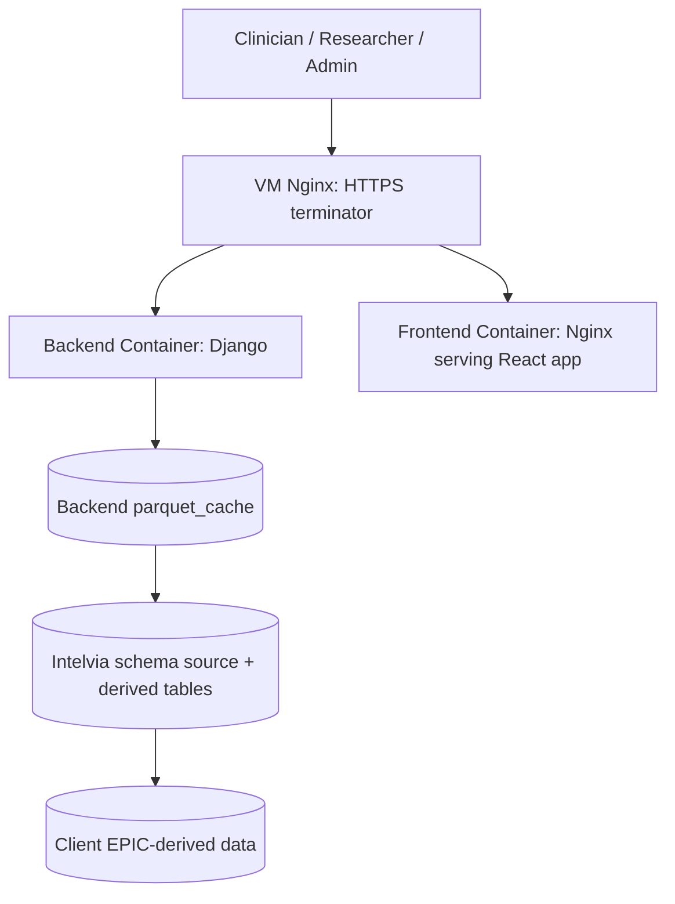

# Sanguine Blood Usage Visualization

Sanguine is a web-based platform for exploring hospital blood usage, patient blood management metrics, and surgery-level outcomes. It is intended for clinicians, researchers, and administrators who need to understand transfusion patterns, identify opportunities to improve care, and reduce blood product cost.


For deployment or partnership inquiries, contact `contact@intelvia.io`.

## Table of Contents

1. [Overview](#overview)
1. [Architecture](#architecture)
1. [Development Setup](#development-setup)
1. [Common Development Tasks](#common-development-tasks)
1. [Testing](#testing)
1. [Deployment](#deployment)
1. [Derived Data Pipeline](#derived-data-pipeline)
1. [Security and Monitoring](#security-and-monitoring)

## Overview

Sanguine combines a React frontend, a Django backend, a MariaDB source database, and cached parquet artifacts to make large-scale PBM exploration practical in the browser. The backend prepares derived datasets and parquet caches, and the frontend uses DuckDB WASM to query those parquet files client-side for interactive analysis.

We currently support multiple deployments, including University of Utah and partner institutions.

## Architecture



## Development Setup

For local development, run backend and MariaDB in Docker and run the frontend on your host for fast HMR.

1. Copy `.env.default` to `.env` in the project root.
1. Start backend and MariaDB:

```bash
docker compose -f docker-compose.dev.yml up
```

1. In another terminal, start the frontend:

```bash
cd frontend
yarn install
yarn serve
```

1. Open `http://localhost:8080`.

Notes:

- The frontend uses relative `/api/...` paths and Vite proxies them to `http://localhost:8000`.
- The backend test runner automatically creates the derived artifact tables after the test database is created.

## Common Development Tasks

### Rebuild Mock Data End-to-End

```bash
docker compose -f docker-compose.dev.yml exec -it backend bash
# Default is --size lg (10^6 rows)
poetry run python manage.py recreatedata --size sm|md|lg
```

### Rebuild Step-by-Step

```bash
docker compose -f docker-compose.dev.yml exec -it backend bash
poetry run python manage.py destroydata
poetry run python manage.py migrate
poetry run python manage.py migrate_derived_tables
# Default is --size lg
poetry run python manage.py mockdata --size sm|md|lg
poetry run python manage.py refresh_derived_tables
poetry run python manage.py generate_parquets
```

### Regenerate Parquets Only

```bash
poetry run python manage.py generate_parquets
```

### Refresh Derived Tables Only

```bash
poetry run python manage.py refresh_derived_tables
```

### Generate a Single Artifact

```bash
poetry run python manage.py generate_parquets --generate visit_attributes
poetry run python manage.py generate_parquets --generate procedure_hierarchy
poetry run python manage.py generate_parquets --generate surgery_cases
```

## Testing

### Backend Tests

Run the backend suite from the backend container:

```bash
docker compose -f docker-compose.dev.yml exec -it backend bash
poetry run python manage.py test api.tests --verbosity 2 --parallel 8
```

The custom Django test runner at `backend/api/tests/runner.py` runs `migrate_derived_tables` after the test database is created, so `GuidelineAdherence`, `VisitAttributes`, and `SurgeryCaseAttributes` exist before fixtures are populated and refreshed.

### Frontend Checks

The frontend currently exposes lint, typecheck, and build validation:

```bash
cd frontend
yarn lint
yarn typecheck
yarn build
```

## Deployment

The production deployment uses separate frontend and backend containers:

- Frontend container: Nginx serving the built React application
- Backend container: Django served by Gunicorn
- External VM nginx: SSL termination and routing to the containers

Start the production stack with:

```bash
docker-compose up
# or
podman-compose up
```

Deployment expectations:

- The VM-level nginx handles SSL termination.
- Requests are routed to the frontend container, which proxies API traffic to the backend container.
- Required environment variables must be present for Django, MariaDB, CAS auth, and any deployment-specific settings. These can be set in a `.env` file or injected through the deployment pipeline.
- After deploy, the backend should run `migrate`, `migrate_derived_tables`, and `generate_parquets` as part of the environment bootstrap.

## Derived Data Pipeline

The backend manages three SQL-owned derived artifacts:

- `GuidelineAdherence`
- `VisitAttributes`
- `SurgeryCaseAttributes`

Their schema and refresh SQL live in `backend/api/models_derived/`.

Key commands:

```bash
poetry run python manage.py migrate_derived_tables
poetry run python manage.py refresh_derived_tables
poetry run python manage.py generate_parquets
```

Responsibilities:

- `migrate_derived_tables`
  Creates or replaces the physical derived tables from `*_schema.sql`.

- `refresh_derived_tables`
  Truncates and repopulates the derived tables from the source MariaDB tables using `*_refresh.sql`.

- `generate_parquets`
  Refreshes the required derived tables, reads them, normalizes values, and writes the parquet cache artifacts used by the frontend.

The derived artifacts are intentionally not represented as Django models. They are treated as SQL-managed cache tables whose correctness is validated by integration tests and parquet generation tests.

## Security and Monitoring

Security controls in Sanguine include:

- Limited firewall and VPN access
- CAS / SSO authentication
- Role-based access control in Django
- Service accounts with limited DB permissions
- VM patching and monitoring handled by hospital IT
- Encryption in transit with SSL

### Sentry Monitoring Setup

The backend supports Sentry for deployment-specific error monitoring.

Set these backend environment variables:

- `SENTRY_DSN`
- `SENTRY_ENVIRONMENT`
- `SENTRY_TRACES_SAMPLE_RATE`
- `SENTRY_SEND_DEFAULT_PII`
- `SENTRY_CAPTURE_HANDLED_HTTP_ERRORS`

When `SENTRY_DSN` is not set, Sentry is disabled.

Unhandled backend exceptions are sent to Sentry when configured and are also written to container logs. Handled `4xx/5xx` responses can also be reported when `SENTRY_CAPTURE_HANDLED_HTTP_ERRORS=True`.
